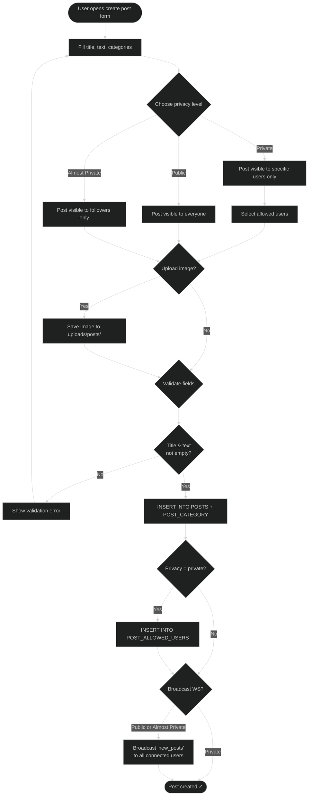
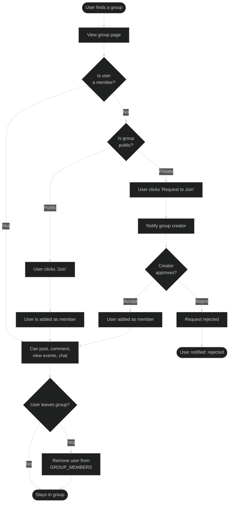
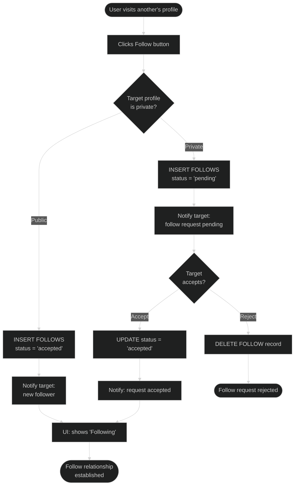

# Activity Diagram — Key Workflows

## Workflow 1: Creating a Post

```mermaid
%%{init: {'theme':'dark'}}%%
flowchart TD
    Start([User opens create post form]) --> FillForm[Fill title, text, categories]
    FillForm --> ChoosePrivacy{Choose privacy level}
    ChoosePrivacy -->|Public| Public[Post visible to everyone]
    ChoosePrivacy -->|Almost Private| AlmostPrivate[Post visible to followers only]
    ChoosePrivacy -->|Private| Private[Post visible to specific users only]

    Private --> SelectUsers[Select allowed users]
    SelectUsers --> UploadImage{Upload image?}
    Public --> UploadImage
    AlmostPrivate --> UploadImage

    UploadImage -->|Yes| SaveImage[Save image to uploads/posts/]
    UploadImage -->|No| Validate{Validate fields}

    SaveImage --> Validate
    Validate --> Valid{Title & text\nnot empty?}
    Valid -->|No| Error[Show validation error]
    Error --> FillForm
    Valid -->|Yes| DB[INSERT INTO POSTS + POST_CATEGORY]

    DB --> AddAllowed{Privacy = private?}
    AddAllowed -->|Yes| InsertAllowed[INSERT INTO POST_ALLOWED_USERS]
    AddAllowed -->|No| Broadcast{Broadcast WS?}

    InsertAllowed --> Broadcast
    Broadcast -->|Public or Almost Private| WS[Broadcast 'new_posts'\nto all connected users]
    Broadcast -->|Private| End([Post created ✓])

    WS --> End
```

## Workflow 2: Group Membership

```mermaid
%%{init: {'theme':'dark'}}%%
flowchart TD
    Start([User finds a group]) --> ViewGroup[View group page]
    ViewGroup --> CheckMembership{Is user\na member?}

    CheckMembership -->|Yes| MemberActions[Can post, comment,\nview events, chat]
    CheckMembership -->|No| IsPublic{Is group\npublic?}

    IsPublic -->|Public| JoinBtn[User clicks 'Join']
    IsPublic -->|Private| RequestBtn[User clicks 'Request to Join']

    JoinBtn --> AutoJoined[User is added as member]
    AutoJoined --> MemberActions

    RequestBtn --> NotifyCreator[Notify group creator]
    NotifyCreator --> CreatorDecision{Creator\napproves?}
    CreatorDecision -->|Accept| Joined[User added as member]
    CreatorDecision -->|Reject| Rejected[Request rejected]

    Joined --> MemberActions
    Rejected --> End([User notified: rejected])

    MemberActions --> Leave{User leaves group?}
    Leave -->|Yes| RemoveMember[Remove user from\nGROUP_MEMBERS]
    Leave -->|No| EndMember([Stays in group])
    RemoveMember --> EndMember
```

## Workflow 3: Follow System

```mermaid
%%{init: {'theme':'dark'}}%%
flowchart TD
    Start([User visits another's profile]) --> ClickFollow[Clicks Follow button]
    ClickFollow --> CheckPrivacy{Target profile\nis private?}

    CheckPrivacy -->|Public| DirectFollow[INSERT FOLLOWS\nstatus = 'accepted']
    CheckPrivacy -->|Private| RequestFollow[INSERT FOLLOWS\nstatus = 'pending']

    DirectFollow --> NotifyFollowee[Notify target:\nnew follower]
    RequestFollow --> NotifyPending[Notify target:\nfollow request pending]

    NotifyFollowee --> UpdateUI[UI: shows 'Following']
    NotifyPending --> TargetDecision{Target\naccepts?}

    TargetDecision -->|Accept| UpdateStatus[UPDATE status = 'accepted']
    TargetDecision -->|Reject| DeleteReq[DELETE FOLLOW record]

    UpdateStatus --> NotifyAccepted[Notify: request accepted]
    DeleteReq --> End2([Follow request rejected])

    NotifyAccepted --> UpdateUI
    UpdateUI --> End1([Follow relationship\nestablished])
```
