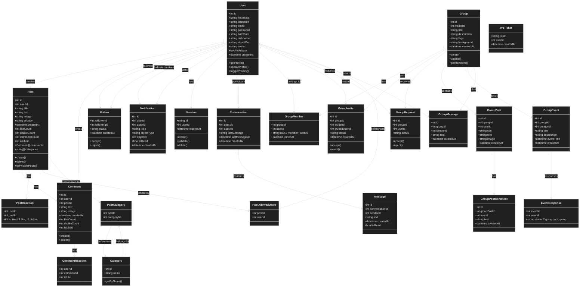

# Class Diagram — Domain Models

```mermaid
%%{init: {'theme':'dark'}}%%
classDiagram
    class User {
        +int id
        +string firstname
        +string lastname
        +string email
        +string password
        +string birthDate
        +string nickname
        +string aboutMe
        +string avatar
        +bool isPrivate
        +datetime createdAt
        +getProfile()
        +updateProfile()
        +togglePrivacy()
    }

    class Session {
        +string id
        +int userId
        +datetime expiresAt
        +create()
        +validate()
        +delete()
    }

    class Post {
        +int id
        +int userId
        +string title
        +string text
        +string image
        +string privacy
        +datetime createdAt
        +int likeCount
        +int dislikeCount
        +int commentCount
        +int isLiked
        +Comment[] comments
        +string[] categories
        +create()
        +delete()
        +getVisiblePosts()
    }

    class PostAllowedUsers {
        +int postId
        +int userId
    }

    class Comment {
        +int id
        +int userId
        +int postId
        +string text
        +string image
        +datetime createdAt
        +int likeCount
        +int dislikeCount
        +int isLiked
        +create()
        +delete()
    }

    class Category {
        +int id
        +string name
        +getByName()
    }

    class PostCategory {
        +int postId
        +int categoryId
    }

    class PostReaction {
        +int userId
        +int postId
        +int isLike  // 1 like, -1 dislike
    }

    class CommentReaction {
        +int userId
        +int commentId
        +int isLike
    }

    class Follow {
        +int followerId
        +int followingId
        +string status
        +datetime createdAt
        +accept()
        +reject()
    }

    class Group {
        +int id
        +int creatorId
        +string title
        +string description
        +string logo
        +string background
        +datetime createdAt
        +create()
        +update()
        +getMembers()
    }

    class GroupMember {
        +int groupId
        +int userId
        +string role  // member | admin
        +datetime joinedAt
    }

    class GroupInvite {
        +int id
        +int groupId
        +int inviterId
        +int invitedUserId
        +string status
        +datetime createdAt
        +accept()
        +reject()
    }

    class GroupRequest {
        +int id
        +int groupId
        +int userId
        +string status
        +accept()
        +reject()
    }

    class GroupPost {
        +int id
        +int groupId
        +int userId
        +string title
        +string text
        +string image
        +datetime createdAt
    }

    class GroupPostComment {
        +int id
        +int groupPostId
        +int userId
        +string text
        +datetime createdAt
    }

    class GroupEvent {
        +int id
        +int groupId
        +int creatorId
        +string title
        +string description
        +datetime eventTime
        +datetime createdAt
    }

    class EventResponse {
        +int eventId
        +int userId
        +string status  // going | not_going
    }

    class GroupMessage {
        +int id
        +int groupId
        +int senderId
        +string text
        +datetime createdAt
    }

    class Conversation {
        +int id
        +int user1Id
        +int user2Id
        +string lastMessage
        +datetime lastMessageAt
        +datetime createdAt
    }

    class Message {
        +int id
        +int conversationId
        +int senderId
        +string text
        +datetime createdAt
        +bool isRead
    }

    class Notification {
        +int id
        +int userId
        +int actorId
        +string type
        +string objectType
        +int objectId
        +bool isRead
        +datetime createdAt
    }

    class WsTicket {
        +string ticket
        +int userId
        +datetime createdAt
    }

    %% ─── Relationships ───

    User "1" --> "*" Post : creates
    User "1" --> "*" Comment : writes
    User "1" --> "*" Follow : follower
    User "1" --> "*" Follow : following
    User "1" --> "*" Notification : receives
    User "1" --> "*" Notification : actor
    User "1" --> "*" Session : has
    User "1" --> "*" Conversation : participant
    User "1" --> "*" GroupMember : belongs to
    User "1" --> "*" GroupInvite : invited
    User "1" --> "*" GroupRequest : requests
    User "1" --> "*" GroupMessage : sends

    Post "1" --> "*" Comment : has
    Post "1" --> "*" PostReaction : has
    Post "1" --> "*" PostAllowedUsers : visible by
    Post "1" --> "*" PostCategory : categorized by

    Comment "1" --> "*" CommentReaction : has

    Group "1" --> "*" GroupMember : has
    Group "1" --> "*" GroupInvite : sent
    Group "1" --> "*" GroupRequest : received
    Group "1" --> "*" GroupPost : contains
    Group "1" --> "*" GroupEvent : hosts
    Group "1" --> "*" GroupMessage : chat

    GroupPost "1" --> "*" GroupPostComment : has

    GroupEvent "1" --> "*" EventResponse : responses

    Conversation "1" --> "*" Message : contains

    Category "1" --> "*" PostCategory : belongs to

    PostAllowedUsers --> User : references
    PostCategory --> Category : references
```
