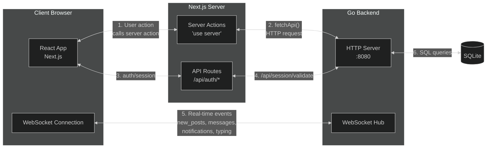

# Component Diagram — System Architecture

```mermaid
%%{init: {'theme':'dark'}}%%
flowchart TB
    subgraph Internet[🌐 Internet]
        Browser[Browser / Client]
    end

    subgraph Frontend["<b>Frontend — Next.js (localhost:3000)</b>"]
        direction TB

        subgraph Pages["Pages"]
            Feed[Feed Page]
            Profile[Profile Page]
            PostDetail[Post Detail Page]
            Groups[Groups Pages]
            Messages[Messages Page]
            Notifs[Notifications Page]
            Settings[Settings Page]
            Auth[Login / Register]
        end

        subgraph Components["Shared Components"]
            Sidebar[Sidebar]
            Sidebar2[Right Sidebar]
            Header[Header]
            EmojiPicker[Emoji Picker]
            SearchInput[Search Input]
            MobileNav[Mobile Navigation]
            Toast[Toast Notifications]
        end

        subgraph ServerActions["Server Actions (_services/crud/)"]
            PostActions[post.ts]
            GroupActions[groups.ts]
            ConvActions[conversations.ts]
            FollowActions[follow.ts]
            NotifActions[notification.ts]
            ProfileActions[getProfile.ts]
            SearchActions[search.ts]
        end

        subgraph API["API Routes (app/api/)"]
            NextAuth[NextAuth Handler\n/api/auth/[...nextauth]]
            WSTicket[WS Ticket\n/api/ws-ticket]
        end

        subgraph Providers[Providers]
            SessionProv[SessionProvider]
            WSProv[WebSocket Provider]
        end

        Pages --> ServerActions
        Pages --> Components
        Pages --> Providers
    end

    subgraph Backend["<b>Backend — Go (localhost:8080)</b>"]
        direction TB

        subgraph Handlers["HTTP Handlers"]
            H_Auth[auth.go — Login/Register]
            H_Post[post.go — CRUD + WS notifications]
            H_Comment[comment.go — Create/Delete]
            H_Follow[follow.go — Follow/Unfollow]
            H_Group[groups.go — Full group management]
            H_Profile[profile.go — View/Update]
            H_Conv[conversation.go — Messages]
            H_Notif[notifications.go — Fetch/Manage]
            H_Search[search.go — Users/Groups]
            H_WS[ws.go — WebSocket upgrade]
            H_Reaction[reaction.go — Like/Dislike]
        end

        subgraph Repos["Repository Layer"]
            R_User[user.go]
            R_Post[post.go]
            R_Comment[comment.go]
            R_Follow[follow.go]
            R_Group[group_repo.go]
            R_GroupEvents[group_events.go]
            R_GroupPosts[group_posts.go]
            R_Conv[conversation.go]
            R_Notif[notification.go]
            R_Reaction[reaction.go]
            R_Category[category.go]
            R_Profile[profile.go]
        end

        subgraph Middleware["Middleware"]
            M_Auth[Auth — session cookie]
            M_RateLimit[Rate Limiter]
        end

        subgraph WS["WebSocket Hub"]
            WS_Client[Client Manager]
            WS_Msg[Message Handler]
            WS_Typing[Typing Indicator]
        end

        subgraph Utils["Utilities"]
            U_Image[Image Saver]
            U_Time[TimeAgo]
            U_Validator[Validators]
            U_Ticket[Ticket Manager]
            U_Write[JSON Writer]
            U_OAuth[OAuth Helpers]
        end

        Routes[Route Mux\nnet/http]
        Routes --> Handlers
        Handlers --> Repos
        Handlers --> Utils
        Handlers --> WS
        Repos --> DB[(SQLite Database)]
    end

    Browser <--> |HTTP/REST| Frontend
    Frontend <--> |Server Actions → HTTP| Backend
    Browser <--> |WebSocket /ws?ticket=| WS
    NextAuth <--> |Session validation| Backend
```

## Communication Flow


