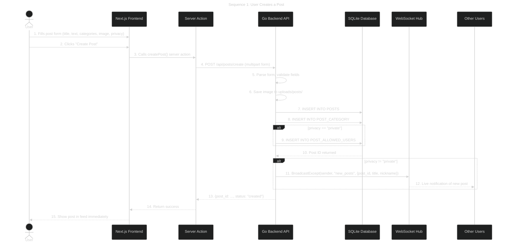
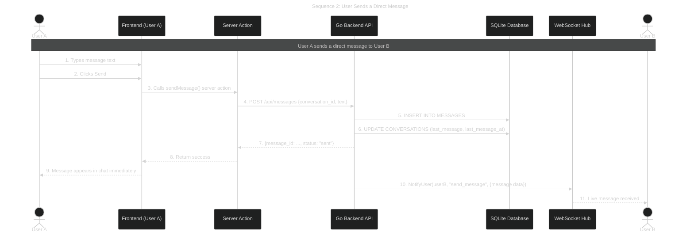
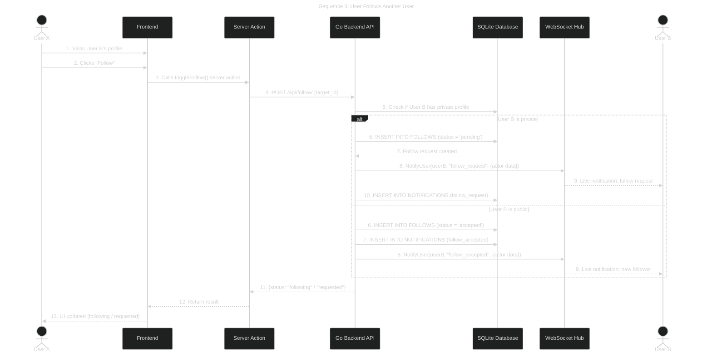

# Sequence Diagram — Key Interactions

```mermaid
%%{init: {'theme':'dark'}}%%
sequenceDiagram
    title Sequence 1: User Creates a Post

    actor User
    participant Frontend as Next.js Frontend
    participant ServerAction as Server Action
    participant GoAPI as Go Backend API
    participant DB as SQLite Database
    participant WS as WebSocket Hub

    User->>Frontend: 1. Fills post form (title, text, categories, image, privacy)
    User->>Frontend: 2. Clicks "Create Post"
    Frontend->>ServerAction: 3. Calls createPost() server action
    ServerAction->>GoAPI: 4. POST /api/posts/create (multipart form)
    GoAPI->>GoAPI: 5. Parse form, validate fields
    GoAPI->>GoAPI: 6. Save image to uploads/posts/
    GoAPI->>DB: 7. INSERT INTO POSTS
    GoAPI->>DB: 8. INSERT INTO POST_CATEGORY
    alt privacy == "private"
        GoAPI->>DB: 9. INSERT INTO POST_ALLOWED_USERS
    end
    DB-->>GoAPI: 10. Post ID returned
    alt privacy != "private"
        GoAPI->>WS: 11. BroadcastExcept(sender, "new_posts", {post_id, title, nickname})
        WS-->>Other Users: 12. Live notification of new post
    end
    GoAPI-->>ServerAction: 13. {post_id: ..., status: "created"}
    ServerAction-->>Frontend: 14. Return success
    Frontend-->>User: 15. Show post in feed immediately
```

```mermaid
%%{init: {'theme':'dark'}}%%
sequenceDiagram
    title Sequence 2: User Sends a Direct Message

    actor UserA as User A
    participant FrontendA as Frontend (User A)
    participant SA as Server Action
    participant GoAPI as Go Backend API
    participant DB as SQLite Database
    participant WS as WebSocket Hub
    actor UserB as User B

    Note over UserA,UserB: User A sends a direct message to User B

    UserA->>FrontendA: 1. Types message text
    UserA->>FrontendA: 2. Clicks Send
    FrontendA->>SA: 3. Calls sendMessage() server action
    SA->>GoAPI: 4. POST /api/messages {conversation_id, text}
    GoAPI->>DB: 5. INSERT INTO MESSAGES
    GoAPI->>DB: 6. UPDATE CONVERSATIONS (last_message, last_message_at)
    GoAPI-->>SA: 7. {message_id: ..., status: "sent"}
    SA-->>FrontendA: 8. Return success
    FrontendA-->>UserA: 9. Message appears in chat immediately
    GoAPI->>WS: 10. NotifyUser(userB, "send_message", {message data})
    WS-->>UserB: 11. Live message received
```

```mermaid
%%{init: {'theme':'dark'}}%%
sequenceDiagram
    title Sequence 3: User Follows Another User

    actor UserA as User A
    participant Frontend as Frontend
    participant SA as Server Action
    participant GoAPI as Go Backend API
    participant DB as SQLite Database
    participant WS as WebSocket Hub
    actor UserB as User B

    UserA->>Frontend: 1. Visits User B's profile
    UserA->>Frontend: 2. Clicks "Follow"
    Frontend->>SA: 3. Calls toggleFollow() server action
    SA->>GoAPI: 4. POST /api/follow/ {target_id}
    GoAPI->>DB: 5. Check if User B has private profile

    alt User B is private
        GoAPI->>DB: 6. INSERT INTO FOLLOWS (status = 'pending')
        DB-->>GoAPI: 7. Follow request created
        GoAPI->>WS: 8. NotifyUser(userB, "follow_request", {actor data})
        WS-->>UserB: 9. Live notification: follow request
        GoAPI->>DB: 10. INSERT INTO NOTIFICATIONS (follow_request)
    else User B is public
        GoAPI->>DB: 6. INSERT INTO FOLLOWS (status = 'accepted')
        GoAPI->>DB: 7. INSERT INTO NOTIFICATIONS (follow_accepted)
        GoAPI->>WS: 8. NotifyUser(userB, "follow_accepted", {actor data})
        WS-->>UserB: 9. Live notification: new follower
    end

    GoAPI-->>SA: 11. {status: "following" / "requested"}
    SA-->>Frontend: 12. Return result
    Frontend-->>UserA: 13. UI updated (following / requested)
```
